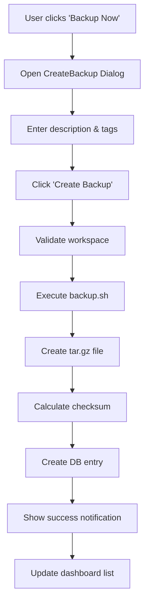
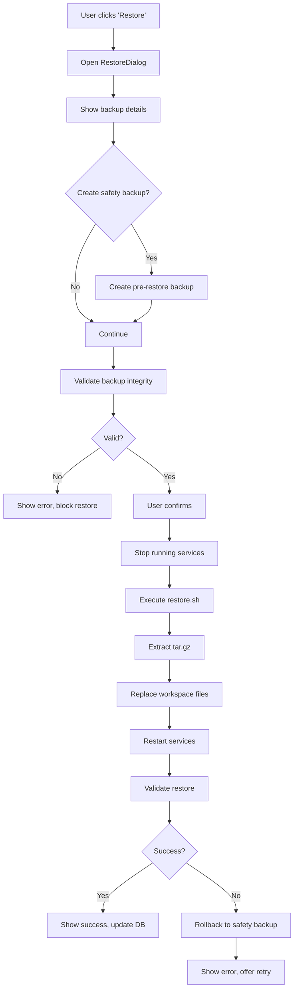
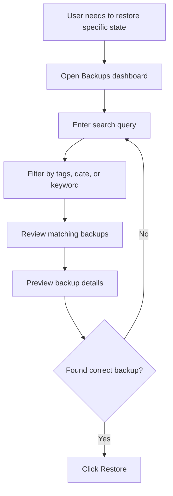

# Mission Control: Backup & Restore Management System
## Architecture & Implementation Guide

**Version:** 1.0  
**Date:** 2026-02-23  
**Status:** Production-Ready Design

---

## Table of Contents
1. [System Overview](#system-overview)
2. [Database Schema](#database-schema)
3. [File Structure](#file-structure)
4. [API Endpoints](#api-endpoints)
5. [UI Components](#ui-components)
6. [Workflows](#workflows)
7. [Integration Points](#integration-points)
8. [Testing Strategy](#testing-strategy)
9. [Security & Validation](#security--validation)
10. [UX Design Philosophy](#ux-design-philosophy)

---

## System Overview

### Purpose
Provide a centralized, user-friendly interface for managing workspace backups with metadata, descriptions, and one-click restore capabilities.

### Key Features
- **Dashboard:** Visual list of all backups with searchable/filterable metadata
- **Descriptions:** Editable descriptions to track what changed in each backup
- **One-Click Restore:** Validate, confirm, and restore backups with progress tracking
- **Instant Backup:** Create new backups with custom descriptions
- **Smart Search:** Find backups by date, description, size, or filename
- **Integrity Validation:** Automatic backup health checks before restore
- **History Tracking:** Complete audit trail of backup/restore operations

### Architecture Principles
1. **Non-Destructive:** Never delete or overwrite backups without explicit user confirmation
2. **Fast Metadata Access:** Database-driven queries, no tar inspection for listings
3. **Graceful Degradation:** UI works even if backup files are moved/deleted
4. **Progressive Enhancement:** Basic functionality first, advanced features layered on
5. **Atomic Operations:** Backups complete fully or fail entirely

---

## Database Schema

### Convex Schema Extension
Add to `convex/schema.ts`:

```typescript
// BACKUP MANAGEMENT
backups: defineTable({
  // File metadata
  filename: v.string(),              // Full filename (e.g., "workspace_20260223_183000.tar.gz")
  filepath: v.string(),              // Absolute path to backup file
  size: v.number(),                  // Size in bytes
  
  // User-editable metadata
  description: v.string(),           // User-provided description
  tags: v.array(v.string()),         // Searchable tags ["cold-email", "v1", "complete"]
  
  // Backup context
  backupType: v.union(
    v.literal("manual"),             // User-triggered from UI
    v.literal("auto"),               // Scheduled/cron backup
    v.literal("pre-restore"),        // Safety backup before restore
    v.literal("milestone")           // Major version/release marker
  ),
  
  // Technical metadata
  workspaceSize: v.number(),         // Total workspace size at backup time
  fileCount: v.optional(v.number()), // Number of files in backup
  checksum: v.optional(v.string()),  // SHA256 hash for integrity
  compression: v.string(),           // "gzip" (future: "zstd", "lz4")
  
  // Status tracking
  status: v.union(
    v.literal("completed"),          // Backup successful and verified
    v.literal("failed"),             // Backup failed
    v.literal("partial"),            // Backup completed with warnings
    v.literal("archived"),           // Moved to cold storage
    v.literal("deleted")             // Soft-deleted (file may still exist)
  ),
  
  // Validation
  isValid: v.boolean(),              // Passed integrity check
  validatedAt: v.optional(v.number()), // Last validation timestamp
  validationError: v.optional(v.string()),
  
  // Timestamps
  createdAt: v.number(),             // When backup was created
  createdBy: v.optional(v.string()), // agentId or "user"
  updatedAt: v.number(),             // Last metadata update
  
  // Retention
  retentionPolicy: v.optional(v.string()), // "keep-forever", "30-days", "90-days"
  expiresAt: v.optional(v.number()),       // Auto-deletion timestamp
}),

// RESTORE OPERATIONS
restoreOperations: defineTable({
  // Source backup
  backupId: v.id("backups"),
  backupFilename: v.string(),
  
  // Operation context
  requestedBy: v.optional(v.string()), // agentId or "user"
  reason: v.optional(v.string()),      // Why restore was needed
  
  // Pre-restore safety backup
  preRestoreBackupId: v.optional(v.id("backups")),
  
  // Status tracking
  status: v.union(
    v.literal("validating"),         // Checking backup integrity
    v.literal("creating-safety-backup"), // Pre-restore backup
    v.literal("extracting"),         // Unpacking backup
    v.literal("restoring"),          // Applying files
    v.literal("completed"),          // Restore successful
    v.literal("failed"),             // Restore failed
    v.literal("rolled-back")         // Reverted to pre-restore state
  ),
  
  // Progress tracking
  progressPercent: v.number(),       // 0-100
  currentStep: v.string(),           // Human-readable current action
  
  // Timing
  startedAt: v.number(),
  completedAt: v.optional(v.number()),
  duration: v.optional(v.number()),  // milliseconds
  
  // Results
  filesRestored: v.optional(v.number()),
  bytesRestored: v.optional(v.number()),
  error: v.optional(v.string()),
  logs: v.optional(v.array(v.string())), // Step-by-step logs
}),

// BACKUP ANALYTICS
backupMetrics: defineTable({
  date: v.string(),                  // YYYY-MM-DD
  totalBackups: v.number(),
  totalSize: v.number(),             // bytes
  manualBackups: v.number(),
  autoBackups: v.number(),
  restoreOperations: v.number(),
  successfulRestores: v.number(),
  failedRestores: v.number(),
  avgBackupSize: v.number(),
  avgBackupDuration: v.optional(v.number()),
}),
```

### Index Strategy
```typescript
// In schema.ts, add indexes for common queries:
.index("by_createdAt", ["createdAt"])
.index("by_status", ["status", "createdAt"])
.index("by_type", ["backupType", "createdAt"])
.index("by_tags", ["tags"])  // Array field index
```

---

## File Structure

### Frontend Structure
```
mission-control/
├── app/
│   └── app/
│       └── backups/                    # NEW: Backup management route
│           ├── page.tsx                # Main dashboard
│           ├── layout.tsx              # Backups layout wrapper
│           ├── sections/
│           │   ├── BackupList.tsx      # Searchable backup table
│           │   ├── BackupCard.tsx      # Individual backup card
│           │   ├── BackupFilters.tsx   # Search/filter controls
│           │   ├── BackupStats.tsx     # Quick stats overview
│           │   ├── CreateBackup.tsx    # "Backup Now" dialog
│           │   ├── RestoreDialog.tsx   # Restore confirmation flow
│           │   ├── RestoreProgress.tsx # Live restore status
│           │   ├── BackupDetails.tsx   # Detailed backup view
│           │   └── BackupSettings.tsx  # Retention policies, etc.
│           └── [backupId]/
│               └── page.tsx            # Individual backup detail page
│
├── convex/
│   ├── backups.ts                      # NEW: Backup CRUD operations
│   ├── restore.ts                      # NEW: Restore operations
│   ├── backupMetrics.ts                # NEW: Analytics queries
│   └── schema.ts                       # Updated with backup tables
│
├── lib/
│   ├── backup/
│   │   ├── BackupService.ts            # Core backup logic
│   │   ├── RestoreService.ts           # Core restore logic
│   │   ├── ValidationService.ts        # Integrity checks
│   │   └── types.ts                    # TypeScript interfaces
│   └── utils/
│       ├── formatFileSize.ts           # Human-readable sizes
│       └── formatDuration.ts           # Human-readable durations
│
└── components/
    └── ui/
        ├── ProgressBar.tsx             # Reusable progress indicator
        └── ConfirmDialog.tsx           # Reusable confirmation modal
```

### Backend Scripts
```
workspace/
└── ops/
    ├── backup.sh                       # Existing backup script (enhanced)
    ├── restore.sh                      # NEW: Restore script
    ├── validate-backup.sh              # NEW: Integrity check script
    └── cleanup-backups.sh              # NEW: Retention policy enforcement
```

---

## API Endpoints

### Convex Functions (convex/backups.ts)

#### Queries
```typescript
// List all backups with optional filters
export const listBackups = query({
  args: {
    status: v.optional(v.string()),
    backupType: v.optional(v.string()),
    search: v.optional(v.string()),      // Search in description/tags
    limit: v.optional(v.number()),
    offset: v.optional(v.number()),
  },
  handler: async (ctx, args) => {
    // Query with filters, sort by createdAt desc
    // Include file existence check
    // Return paginated results
  }
});

// Get single backup details
export const getBackup = query({
  args: { backupId: v.id("backups") },
  handler: async (ctx, args) => {
    // Fetch backup + validate file still exists
    // Include related restore operations
  }
});

// Get backup statistics
export const getBackupStats = query({
  handler: async (ctx) => {
    // Total backups, total size, latest backup, oldest backup
    // Storage growth trends
  }
});

// Search backups by text
export const searchBackups = query({
  args: { query: v.string() },
  handler: async (ctx, args) => {
    // Full-text search across description, tags, filename
  }
});
```

#### Mutations
```typescript
// Create new backup
export const createBackup = mutation({
  args: {
    description: v.string(),
    tags: v.optional(v.array(v.string())),
    backupType: v.optional(v.string()),
  },
  handler: async (ctx, args) => {
    // 1. Trigger backup script via API call
    // 2. Wait for completion
    // 3. Create database entry with metadata
    // 4. Return backup ID
  }
});

// Update backup metadata
export const updateBackup = mutation({
  args: {
    backupId: v.id("backups"),
    description: v.optional(v.string()),
    tags: v.optional(v.array(v.string())),
    retentionPolicy: v.optional(v.string()),
  },
  handler: async (ctx, args) => {
    // Update editable fields only
    // Set updatedAt timestamp
  }
});

// Validate backup integrity
export const validateBackup = mutation({
  args: { backupId: v.id("backups") },
  handler: async (ctx, args) => {
    // 1. Check file exists
    // 2. Run tar -tzf (list contents)
    // 3. Verify checksum if available
    // 4. Update isValid and validatedAt
  }
});

// Soft delete backup
export const deleteBackup = mutation({
  args: {
    backupId: v.id("backups"),
    deleteFile: v.boolean(),  // Actually delete file vs soft-delete
  },
  handler: async (ctx, args) => {
    // Mark as deleted in DB
    // Optionally remove file from disk
  }
});
```

### Convex Functions (convex/restore.ts)

```typescript
// Start restore operation
export const startRestore = mutation({
  args: {
    backupId: v.id("backups"),
    reason: v.optional(v.string()),
    createSafetyBackup: v.boolean(),
  },
  handler: async (ctx, args) => {
    // 1. Validate backup exists and is valid
    // 2. Create pre-restore safety backup if requested
    // 3. Create restoreOperation record
    // 4. Trigger restore script
    // 5. Return operation ID
  }
});

// Get restore operation status
export const getRestoreStatus = query({
  args: { operationId: v.id("restoreOperations") },
  handler: async (ctx, args) => {
    // Fetch current status, progress, logs
  }
});

// List restore history
export const listRestoreHistory = query({
  args: {
    limit: v.optional(v.number()),
  },
  handler: async (ctx, args) => {
    // Recent restore operations with status
  }
});

// Cancel ongoing restore
export const cancelRestore = mutation({
  args: { operationId: v.id("restoreOperations") },
  handler: async (ctx, args) => {
    // Attempt to cancel restore process
    // Update status to "failed" with reason
  }
});
```

### REST API Endpoints (Next.js API Routes)

```typescript
// app/api/backup/create/route.ts
POST /api/backup/create
Body: { description: string, tags?: string[] }
- Executes backup.sh script
- Returns: { success: boolean, backupId: string, filename: string }

// app/api/backup/validate/route.ts
POST /api/backup/validate
Body: { backupId: string }
- Runs validation checks
- Returns: { valid: boolean, errors?: string[] }

// app/api/restore/start/route.ts
POST /api/restore/start
Body: { backupId: string, createSafetyBackup: boolean }
- Executes restore.sh script
- Returns: { success: boolean, operationId: string }

// app/api/restore/progress/[operationId]/route.ts
GET /api/restore/progress/:operationId
- WebSocket-compatible for live updates
- Returns: { status: string, percent: number, currentStep: string }
```

---

## UI Components

### 1. Backup Dashboard (`app/backups/page.tsx`)
```typescript
export default function BackupsPage() {
  // Layout:
  // - Header with "Backup Now" button
  // - Quick stats cards (total backups, total size, last backup)
  // - Search/filter bar
  // - Backup list (table or card view toggle)
  // - Pagination controls
}
```

**Key Features:**
- Real-time updates via Convex subscription
- Keyboard shortcuts (N for new backup, / for search)
- Bulk actions (delete, tag, validate)
- Export backup list as CSV

### 2. Backup List (`sections/BackupList.tsx`)
```typescript
interface BackupListProps {
  backups: Backup[];
  onRestore: (backupId: string) => void;
  onEdit: (backupId: string) => void;
  onDelete: (backupId: string) => void;
}
```

**Columns:**
- **Thumbnail:** Icon + backup type badge
- **Description:** Editable inline (click to edit)
- **Date:** Relative time + absolute tooltip
- **Size:** Human-readable (MB/GB)
- **Status:** Health indicator (✓ Valid | ⚠ Needs validation | ✗ Invalid)
- **Actions:** Restore, Edit, Download, Delete

**Smart Features:**
- **Visual Timeline:** Group by week/month
- **Quick Filters:** Today, This Week, Last Month, Manual Only, Auto Only
- **Status Badges:** Color-coded (green=valid, yellow=unknown, red=invalid)

### 3. Create Backup Dialog (`sections/CreateBackup.tsx`)
```typescript
interface CreateBackupDialogProps {
  open: boolean;
  onClose: () => void;
  onSuccess: (backupId: string) => void;
}
```

**Form Fields:**
- **Description** (required): Text input with autocomplete from previous descriptions
- **Tags** (optional): Multi-select tag input with suggestions
- **Backup Type**: Radio buttons (Manual, Milestone)
- **Retention Policy**: Dropdown (Keep Forever, 30 Days, 90 Days)

**Flow:**
1. User fills form
2. Click "Create Backup"
3. Show progress spinner with live status
4. On completion: "Backup created! View details" or "Edit description"

### 4. Restore Dialog (`sections/RestoreDialog.tsx`)
```typescript
interface RestoreDialogProps {
  backup: Backup;
  open: boolean;
  onClose: () => void;
  onConfirm: () => void;
}
```

**Stages:**
1. **Confirmation Screen:**
   - Show backup details (date, size, description)
   - Warning: "This will replace your current workspace"
   - Checkbox: "Create safety backup before restoring"
   - Buttons: Cancel | Restore

2. **Validation Screen:**
   - Check backup integrity
   - Show validation results
   - If valid: Continue to restore
   - If invalid: Block restore, offer re-download or delete

3. **Progress Screen:**
   - Live progress bar (0-100%)
   - Current step indicator
   - Estimated time remaining
   - Cancel button (with confirmation)

4. **Completion Screen:**
   - Success: "✓ Workspace restored! Restart recommended."
   - Failure: "✗ Restore failed. Workspace untouched. [View logs]"
   - Safety backup link (if created)

### 5. Backup Details Page (`app/backups/[backupId]/page.tsx`)
```typescript
// Full-page detail view with:
// - Large description editor
// - File tree preview (sample of contents)
// - Restore history (if this backup was restored)
// - Technical details (checksum, compression, file count)
// - Related backups (before/after in timeline)
// - Download button
// - Delete button (with confirmation)
```

### 6. Backup Stats Widget (`sections/BackupStats.tsx`)
```typescript
// Dashboard widget showing:
// - Total Backups: 47
// - Total Size: 8.3 GB
// - Last Backup: 2 hours ago
// - Storage Trend: ↑ 150 MB/week
// - Next Auto Backup: Tomorrow at 2 AM
```

---

## Workflows

### Workflow 1: Create Manual Backup


**Error Handling:**
- Insufficient disk space → Show error, suggest cleanup
- Backup script fails → Rollback partial files, log error
- Network issue (future cloud sync) → Retry with exponential backoff

### Workflow 2: Restore from Backup


**Critical Safety Checks:**
- Pre-restore backup always created (unless explicitly disabled)
- Atomic restore: All files or none (no partial restores)
- Service stop before restore to prevent file locks
- Post-restore validation (check file counts, key files exist)

### Workflow 3: Search & Find Backup


**Search Features:**
- **Full-text search:** Description, tags, filename
- **Date filters:** Date picker, quick ranges (Last 7 days, Last month)
- **Tag filters:** Click tag to filter by that tag
- **Status filters:** Valid only, needs validation
- **Sort options:** Newest first, oldest first, largest first

---

## Integration Points

### 1. Existing Backup System (`ops/backup.sh`)
**Current Script:**
```bash
#!/bin/bash
WORKSPACE="/Users/openclaw/.openclaw/workspace"
BACKUP_DIR="/Users/openclaw/.openclaw/backups"
TIMESTAMP=$(date +%Y%m%d_%H%M%S)
BACKUP_NAME="${BACKUP_DIR}/workspace_${TIMESTAMP}.tar.gz"

mkdir -p "$BACKUP_DIR"
cd "$WORKSPACE"
tar -czf "$BACKUP_NAME" --exclude='node_modules' --exclude='backups' .
echo "✅ Backup complete: $(ls -lh "$BACKUP_NAME" | awk '{print $5}') - $(basename "$BACKUP_NAME")"
```

**Enhanced Version:**
```bash
#!/bin/bash
# Enhanced backup script with metadata integration

set -e

WORKSPACE="/Users/openclaw/.openclaw/workspace"
BACKUP_DIR="/Users/openclaw/.openclaw/backups"
TIMESTAMP=$(date +%Y%m%d_%H%M%S)

# Parse arguments
DESCRIPTION="${1:-Automatic backup}"
TAGS="${2:-}"
BACKUP_TYPE="${3:-auto}"

# Generate filename
if [ "$BACKUP_TYPE" = "manual" ] && [ -n "$DESCRIPTION" ]; then
  # Use description in filename (sanitized)
  DESC_SLUG=$(echo "$DESCRIPTION" | tr '[:upper:]' '[:lower:]' | tr ' ' '-' | sed 's/[^a-z0-9-]//g' | cut -c1-50)
  BACKUP_NAME="${BACKUP_DIR}/workspace_${DESC_SLUG}_${TIMESTAMP}.tar.gz"
else
  BACKUP_NAME="${BACKUP_DIR}/workspace_${TIMESTAMP}.tar.gz"
fi

# Create backup directory
mkdir -p "$BACKUP_DIR"

# Pre-backup checks
echo "🔍 Checking workspace..."
WORKSPACE_SIZE=$(du -sk "$WORKSPACE" | awk '{print $1}')
BACKUP_DISK_FREE=$(df -k "$BACKUP_DIR" | tail -1 | awk '{print $4}')

if [ $WORKSPACE_SIZE -gt $BACKUP_DISK_FREE ]; then
  echo "❌ Error: Insufficient disk space"
  exit 1
fi

# Create backup
echo "📦 Creating backup: $(basename $BACKUP_NAME)"
cd "$WORKSPACE"

# Count files (for metadata)
FILE_COUNT=$(find . -type f | wc -l | tr -d ' ')

# Create tar with progress
tar -czf "$BACKUP_NAME" \
  --exclude='node_modules' \
  --exclude='backups' \
  --exclude='.next' \
  --exclude='.DS_Store' \
  .

# Calculate checksum
CHECKSUM=$(shasum -a 256 "$BACKUP_NAME" | awk '{print $1}')

# Get file size
FILE_SIZE=$(stat -f%z "$BACKUP_NAME")

# Output JSON for Mission Control to parse
cat <<EOF
{
  "success": true,
  "filename": "$(basename $BACKUP_NAME)",
  "filepath": "$BACKUP_NAME",
  "size": $FILE_SIZE,
  "fileCount": $FILE_COUNT,
  "workspaceSize": $(($WORKSPACE_SIZE * 1024)),
  "checksum": "$CHECKSUM",
  "compression": "gzip",
  "description": "$DESCRIPTION",
  "tags": "$TAGS",
  "backupType": "$BACKUP_TYPE",
  "timestamp": $(date +%s)
}
EOF

echo "✅ Backup complete: $(ls -lh "$BACKUP_NAME" | awk '{print $5}') - $(basename "$BACKUP_NAME")"
```

### 2. New Restore Script (`ops/restore.sh`)
```bash
#!/bin/bash
# Workspace restore script with safety checks

set -e

WORKSPACE="/Users/openclaw/.openclaw/workspace"
BACKUP_FILE="$1"
OPERATION_ID="${2:-unknown}"

if [ -z "$BACKUP_FILE" ]; then
  echo "❌ Error: Backup file required"
  exit 1
fi

if [ ! -f "$BACKUP_FILE" ]; then
  echo "❌ Error: Backup file not found: $BACKUP_FILE"
  exit 1
fi

# Log progress for Mission Control
log_progress() {
  echo "PROGRESS:$1:$2"  # Format: PROGRESS:percent:message
}

log_progress 10 "Validating backup file..."

# Validate tar file
if ! tar -tzf "$BACKUP_FILE" > /dev/null 2>&1; then
  echo "❌ Error: Corrupt backup file"
  exit 1
fi

log_progress 20 "Stopping services..."

# Stop services (if running)
pkill -f "next dev" || true
sleep 2

log_progress 30 "Creating safety backup..."

# Create temporary backup of current state
TEMP_BACKUP="/tmp/pre-restore-$(date +%s).tar.gz"
cd "$WORKSPACE"
tar -czf "$TEMP_BACKUP" --exclude='node_modules' --exclude='backups' --exclude='.next' .

log_progress 50 "Extracting backup..."

# Clear workspace (except exclusions)
find "$WORKSPACE" -mindepth 1 -maxdepth 1 ! -name 'node_modules' ! -name 'backups' ! -name '.next' -exec rm -rf {} +

log_progress 70 "Restoring files..."

# Extract backup
cd "$WORKSPACE"
tar -xzf "$BACKUP_FILE"

log_progress 90 "Validating restore..."

# Basic validation
if [ ! -f "$WORKSPACE/package.json" ]; then
  echo "❌ Error: Restore validation failed (missing package.json)"
  echo "🔄 Rolling back..."
  tar -xzf "$TEMP_BACKUP"
  exit 1
fi

log_progress 95 "Restarting services..."

# Restart services (background)
cd "$WORKSPACE/mission-control"
npm run dev > /dev/null 2>&1 &

log_progress 100 "Restore complete!"

# Cleanup temp backup (keep for 1 hour)
(sleep 3600 && rm -f "$TEMP_BACKUP") &

echo "✅ Restore complete from $(basename $BACKUP_FILE)"
echo "📁 Safety backup: $TEMP_BACKUP (auto-delete in 1 hour)"
```

### 3. Validation Script (`ops/validate-backup.sh`)
```bash
#!/bin/bash
# Validate backup integrity

BACKUP_FILE="$1"

if [ ! -f "$BACKUP_FILE" ]; then
  echo '{"valid": false, "error": "File not found"}'
  exit 0
fi

# Check tar integrity
if ! tar -tzf "$BACKUP_FILE" > /dev/null 2>&1; then
  echo '{"valid": false, "error": "Corrupt tar file"}'
  exit 0
fi

# Count files
FILE_COUNT=$(tar -tzf "$BACKUP_FILE" | wc -l | tr -d ' ')

# Get size
FILE_SIZE=$(stat -f%z "$BACKUP_FILE")

# Check for key files
HAS_PACKAGE_JSON=$(tar -tzf "$BACKUP_FILE" | grep -c "package.json" || true)

if [ $HAS_PACKAGE_JSON -eq 0 ]; then
  echo '{"valid": false, "error": "Missing package.json"}'
  exit 0
fi

echo "{\"valid\": true, \"fileCount\": $FILE_COUNT, \"size\": $FILE_SIZE}"
```

### 4. Cron Integration (Automatic Backups)
**Update CRON_GOVERNANCE.md:**
```markdown
## Daily Workspace Backup
- **Schedule:** 0 2 * * * (2 AM daily)
- **Script:** ops/backup.sh "Automatic daily backup" "auto,daily" "auto"
- **Retention:** 30 days
- **Purpose:** Automatic safety backups
```

### 5. Mission Control Menu Integration
**Update `app/app/layout.tsx`:**
```typescript
const menuItems = [
  { name: "Tasks", path: "/app/tasks", icon: CheckSquare },
  { name: "Calendar", path: "/app/calendar", icon: Calendar },
  { name: "Team", path: "/app/team", icon: Users },
  { name: "Memory", path: "/app/memory", icon: Brain },
  { name: "Office Space", path: "/app/office", icon: Building2 },
  { name: "Email Cleanup", path: "/app/email-cleanup", icon: Mail },
  { name: "Backups", path: "/app/backups", icon: HardDrive },  // NEW
];
```

---

## Testing Strategy

### Unit Tests
```typescript
// lib/backup/__tests__/BackupService.test.ts
describe('BackupService', () => {
  test('creates backup with valid description', async () => {
    const service = new BackupService();
    const result = await service.createBackup({
      description: 'Test backup',
      tags: ['test']
    });
    expect(result.success).toBe(true);
    expect(result.backupId).toBeDefined();
  });

  test('validates backup file integrity', async () => {
    const service = new BackupService();
    const isValid = await service.validateBackup('backup.tar.gz');
    expect(isValid).toBe(true);
  });

  test('rejects corrupt backup files', async () => {
    const service = new BackupService();
    const isValid = await service.validateBackup('corrupt.tar.gz');
    expect(isValid).toBe(false);
  });
});
```

### Integration Tests
```typescript
// __tests__/integration/backup-restore.test.ts
describe('Backup & Restore Integration', () => {
  test('full backup and restore cycle', async () => {
    // 1. Create backup
    const backup = await createBackup('Integration test');
    
    // 2. Modify workspace
    await modifyWorkspaceFile('test.txt', 'modified');
    
    // 3. Restore backup
    await restoreBackup(backup.id);
    
    // 4. Verify original state
    const content = await readWorkspaceFile('test.txt');
    expect(content).toBe('original');
  });

  test('restore creates safety backup', async () => {
    const backup = await createBackup('Original state');
    const restore = await startRestore(backup.id, { createSafetyBackup: true });
    
    // Verify pre-restore backup was created
    const preRestoreBackup = await getBackup(restore.preRestoreBackupId);
    expect(preRestoreBackup.backupType).toBe('pre-restore');
  });
});
```

### E2E Tests (Playwright)
```typescript
// e2e/backups.spec.ts
test('user can create and restore backup', async ({ page }) => {
  // Navigate to backups page
  await page.goto('/app/backups');
  
  // Create new backup
  await page.click('button:has-text("Backup Now")');
  await page.fill('[name="description"]', 'E2E test backup');
  await page.click('button:has-text("Create Backup")');
  
  // Wait for success
  await page.waitForSelector('text=Backup created!');
  
  // Find backup in list
  const backupRow = page.locator('tr:has-text("E2E test backup")');
  await expect(backupRow).toBeVisible();
  
  // Restore backup
  await backupRow.locator('button:has-text("Restore")').click();
  await page.click('button:has-text("Confirm Restore")');
  
  // Wait for completion
  await page.waitForSelector('text=Restore complete!', { timeout: 60000 });
});
```

### Manual Test Checklist
```markdown
## Pre-Release Testing

### Backup Creation
- [ ] Create manual backup with description
- [ ] Create backup with tags
- [ ] Create backup with retention policy
- [ ] Verify backup file exists in ~/.openclaw/backups/
- [ ] Verify backup appears in dashboard
- [ ] Verify backup metadata is accurate (size, date)

### Backup Management
- [ ] Edit backup description
- [ ] Add/remove tags
- [ ] Search backups by description
- [ ] Filter by date range
- [ ] Filter by backup type
- [ ] Sort by size, date
- [ ] Validate backup integrity
- [ ] Download backup file

### Restore Operations
- [ ] Restore from valid backup
- [ ] Verify safety backup is created
- [ ] Check restore progress updates
- [ ] Confirm workspace is restored correctly
- [ ] Test restore cancellation (if possible)
- [ ] Attempt restore from corrupt backup (should fail gracefully)
- [ ] Verify rollback on restore failure

### Error Handling
- [ ] Insufficient disk space during backup
- [ ] Backup script fails midway
- [ ] Restore from missing backup file
- [ ] Network interruption during backup (future)
- [ ] Service restart failure after restore

### UI/UX
- [ ] Dashboard loads quickly (< 2s)
- [ ] Search is responsive
- [ ] Progress indicators are smooth
- [ ] Confirmation dialogs are clear
- [ ] Success/error messages are helpful
- [ ] Mobile responsive (if applicable)

### Performance
- [ ] Backup creation completes in reasonable time
- [ ] Dashboard with 100+ backups loads fast
- [ ] Search with 100+ backups is instant
- [ ] Restore completes in reasonable time
```

---

## Security & Validation

### File Access Controls
```typescript
// Only allow access to backup directory
const ALLOWED_BACKUP_DIR = '/Users/openclaw/.openclaw/backups';

function validateBackupPath(filepath: string): boolean {
  const resolved = path.resolve(filepath);
  return resolved.startsWith(ALLOWED_BACKUP_DIR);
}
```

### Checksum Verification
```typescript
async function verifyBackupChecksum(
  filepath: string,
  expectedChecksum: string
): Promise<boolean> {
  const hash = crypto.createHash('sha256');
  const stream = fs.createReadStream(filepath);
  
  return new Promise((resolve) => {
    stream.on('data', (chunk) => hash.update(chunk));
    stream.on('end', () => {
      const actualChecksum = hash.digest('hex');
      resolve(actualChecksum === expectedChecksum);
    });
  });
}
```

### Restore Confirmation
```typescript
// Always require explicit user confirmation
interface RestoreConfirmation {
  backupId: string;
  acknowledgeDataLoss: boolean;  // User understands current state will be lost
  createSafetyBackup: boolean;   // Default: true
  confirmationCode?: string;     // Optional: require typing "RESTORE" for critical ops
}
```

### Rate Limiting
```typescript
// Prevent backup spam
const BACKUP_COOLDOWN_MS = 60000; // 1 minute between backups

async function checkBackupCooldown(userId: string): Promise<boolean> {
  const lastBackup = await getLastBackupTime(userId);
  const now = Date.now();
  return (now - lastBackup) > BACKUP_COOLDOWN_MS;
}
```

### Retention Policy Enforcement
```typescript
// Auto-delete old backups based on policy
async function enforceRetentionPolicies() {
  const backups = await getAllBackups();
  const now = Date.now();
  
  for (const backup of backups) {
    if (backup.retentionPolicy === '30-days') {
      const age = now - backup.createdAt;
      if (age > 30 * 24 * 60 * 60 * 1000) {
        await softDeleteBackup(backup.id);
      }
    }
  }
}
```

---

## UX Design Philosophy

### Finding the Right Backup
**The Core UX Challenge:** Users rarely remember exact dates. They remember events.

#### Solution 1: Description-First Design
- **Prominent Descriptions:** Largest text in each row
- **Inline Editing:** Click description to edit (no modal needed)
- **Smart Suggestions:** Auto-suggest previous descriptions while typing
- **Tag Clouds:** Visual tag clusters for quick navigation

#### Solution 2: Visual Timeline
```
Today
├─ [Manual] After email cleanup module - 2:30 PM (1.2 GB)
└─ [Auto] Daily backup - 2:00 AM (1.1 GB)

Yesterday
├─ [Manual] Cold Email Campaign V1 Complete - 11:45 PM (890 MB)
└─ [Auto] Daily backup - 2:00 AM (1.1 GB)

This Week
├─ [Manual] After folder organization - Feb 20, 12:53 PM (1.7 GB)
└─ [Milestone] Fresh Install - Feb 10, 10:20 PM (19 KB)
```

#### Solution 3: Smart Search
- **Natural Language:** "backup before email module" → finds relevant backups
- **Date Shortcuts:** "yesterday", "last week", "feb 20"
- **Tag Autocomplete:** Start typing `#cold` → suggests `#cold-email`, `#cold-start`
- **Fuzzy Matching:** Typos are forgiven

#### Solution 4: Context Preservation
- **What Changed:** Show file diff summary (optional)
- **Who Created:** Manual (you) vs Auto (cron) vs Pre-Restore (safety)
- **Why Created:** Link to restore operation that triggered it
- **Related Backups:** "This backup was restored 3 times"

### Restore Confidence
**The Core UX Challenge:** Users are afraid of losing current work.

#### Solution: Multi-Stage Confirmation
1. **Preview:** Show what will be restored (backup details, age, size)
2. **Warning:** Clear message: "Current workspace will be replaced"
3. **Safety Net:** Auto-create pre-restore backup (opt-out available)
4. **Progress:** Live updates so users know it's working
5. **Validation:** Post-restore check confirms success

#### Visual Trust Signals
- **✓ Validated:** Green checkmark = integrity confirmed
- **⚠ Unknown:** Yellow warning = not validated yet (click to validate)
- **✗ Invalid:** Red X = corrupt or missing (cannot restore)
- **🔒 Safety Backup:** Shield icon = created before restore

### Performance Expectations
- **Dashboard Load:** < 2 seconds for 100 backups
- **Search Results:** < 500ms for any query
- **Backup Creation:** 10-30 seconds for typical workspace
- **Restore Operation:** 20-60 seconds depending on size
- **Progress Updates:** Every 5-10% during restore

### Mobile Considerations (Future)
- **Backup List:** Card view instead of table
- **Actions:** Swipe gestures (swipe left to delete, right to restore)
- **Search:** Full-screen search overlay
- **Restore:** Simplified flow with fewer steps

### Accessibility
- **Keyboard Navigation:** Full keyboard support (Tab, Enter, Escape)
- **Screen Readers:** ARIA labels on all interactive elements
- **Color Blind Safe:** Status indicators use icons + text, not just color
- **High Contrast:** Support high contrast mode

---

## Implementation Roadmap

### Phase 1: Core Functionality (Week 1)
- [ ] Database schema (Convex migrations)
- [ ] Enhanced backup.sh script
- [ ] Basic Convex queries/mutations
- [ ] Backup list UI (read-only)
- [ ] Backup stats widget

**Deliverable:** View existing backups with metadata

### Phase 2: Create Backups (Week 1-2)
- [ ] Create backup API endpoint
- [ ] "Backup Now" dialog
- [ ] Description + tags input
- [ ] Progress indicator
- [ ] Success notification

**Deliverable:** Create new backups from UI

### Phase 3: Restore Functionality (Week 2)
- [ ] restore.sh script
- [ ] Restore API endpoint
- [ ] Restore dialog with confirmation
- [ ] Progress tracking
- [ ] Safety backup creation

**Deliverable:** One-click restore with safety net

### Phase 4: Search & Filters (Week 3)
- [ ] Full-text search implementation
- [ ] Date range filters
- [ ] Tag filters
- [ ] Sort options
- [ ] Visual timeline view

**Deliverable:** Find any backup easily

### Phase 5: Advanced Features (Week 3-4)
- [ ] Backup validation
- [ ] Edit descriptions inline
- [ ] Backup detail page
- [ ] Restore history
- [ ] Analytics dashboard
- [ ] Retention policies

**Deliverable:** Production-ready backup management

### Phase 6: Polish & Testing (Week 4)
- [ ] E2E tests
- [ ] Performance optimization
- [ ] Error handling polish
- [ ] Documentation
- [ ] User guide

**Deliverable:** Ship to production

---

## Appendix

### Example Backup Metadata
```json
{
  "id": "k17abc123xyz",
  "filename": "workspace_cold-email-v1-complete_20260220_002241.tar.gz",
  "filepath": "/Users/openclaw/.openclaw/backups/workspace_cold-email-v1-complete_20260220_002241.tar.gz",
  "size": 33554432,
  "description": "Cold Email Campaign V1 Complete - All modules integrated",
  "tags": ["cold-email", "v1", "milestone"],
  "backupType": "manual",
  "workspaceSize": 52428800,
  "fileCount": 1247,
  "checksum": "a3f5d8e9...",
  "compression": "gzip",
  "status": "completed",
  "isValid": true,
  "validatedAt": 1708416241000,
  "createdAt": 1708416000000,
  "createdBy": "user",
  "updatedAt": 1708416241000,
  "retentionPolicy": "keep-forever"
}
```

### Example Restore Operation
```json
{
  "id": "k28def456uvw",
  "backupId": "k17abc123xyz",
  "backupFilename": "workspace_cold-email-v1-complete_20260220_002241.tar.gz",
  "requestedBy": "user",
  "reason": "Need to go back before breaking changes",
  "preRestoreBackupId": "k29ghi789rst",
  "status": "completed",
  "progressPercent": 100,
  "currentStep": "Restore complete",
  "startedAt": 1708423000000,
  "completedAt": 1708423045000,
  "duration": 45000,
  "filesRestored": 1247,
  "bytesRestored": 52428800,
  "logs": [
    "Validating backup file...",
    "Creating safety backup...",
    "Stopping services...",
    "Extracting backup...",
    "Restoring files...",
    "Validating restore...",
    "Restarting services...",
    "Restore complete!"
  ]
}
```

### File Size Formatting
```typescript
export function formatFileSize(bytes: number): string {
  if (bytes === 0) return '0 B';
  const k = 1024;
  const sizes = ['B', 'KB', 'MB', 'GB', 'TB'];
  const i = Math.floor(Math.log(bytes) / Math.log(k));
  return parseFloat((bytes / Math.pow(k, i)).toFixed(2)) + ' ' + sizes[i];
}
```

### Duration Formatting
```typescript
export function formatDuration(ms: number): string {
  const seconds = Math.floor(ms / 1000);
  const minutes = Math.floor(seconds / 60);
  const hours = Math.floor(minutes / 60);
  
  if (hours > 0) return `${hours}h ${minutes % 60}m`;
  if (minutes > 0) return `${minutes}m ${seconds % 60}s`;
  return `${seconds}s`;
}
```

### Relative Time Formatting
```typescript
export function formatRelativeTime(timestamp: number): string {
  const now = Date.now();
  const diff = now - timestamp;
  const seconds = Math.floor(diff / 1000);
  const minutes = Math.floor(seconds / 60);
  const hours = Math.floor(minutes / 60);
  const days = Math.floor(hours / 24);
  
  if (days > 7) return new Date(timestamp).toLocaleDateString();
  if (days > 0) return `${days} day${days > 1 ? 's' : ''} ago`;
  if (hours > 0) return `${hours} hour${hours > 1 ? 's' : ''} ago`;
  if (minutes > 0) return `${minutes} min${minutes > 1 ? 's' : ''} ago`;
  return 'Just now';
}
```

---

## Success Metrics

### User Experience
- **Time to Find Backup:** < 10 seconds for any backup
- **Restore Completion:** > 95% success rate
- **User Confidence:** Zero data loss incidents
- **Adoption:** Backups created weekly by users (beyond auto-backups)

### Technical Performance
- **Backup Speed:** < 30 seconds for typical workspace
- **Restore Speed:** < 60 seconds for typical workspace
- **Database Queries:** < 100ms for all list/search operations
- **Uptime:** 99.9% availability for backup/restore features

### Business Impact
- **Recovery Time:** Reduce restore time from 15+ minutes (manual) to < 1 minute
- **Data Safety:** Enable fearless experimentation with instant rollback
- **Automation:** 100% of workspaces backed up daily
- **Visibility:** Complete audit trail of all changes

---

**Document Version:** 1.0  
**Last Updated:** 2026-02-23  
**Author:** OpenClaw Architecture Team  
**Status:** ✅ Ready for Implementation
