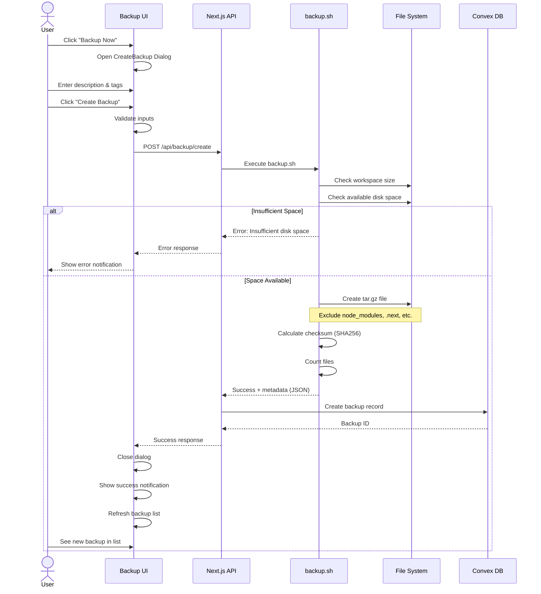
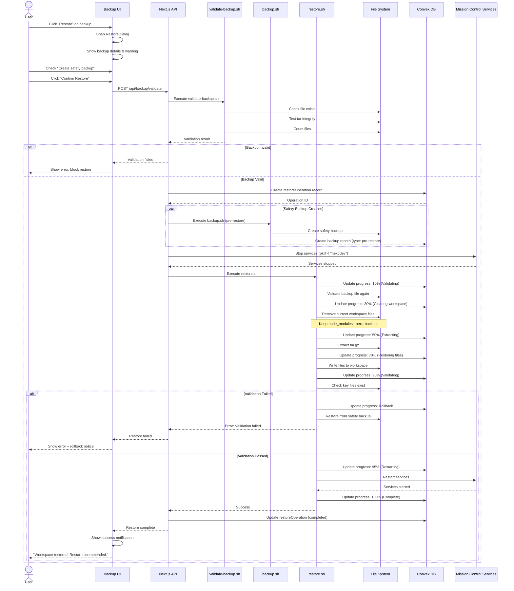
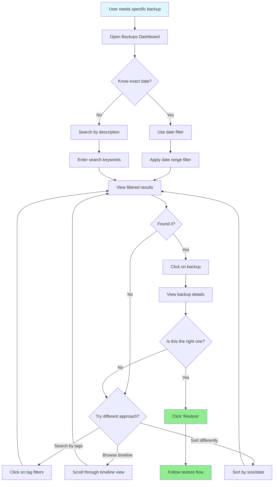
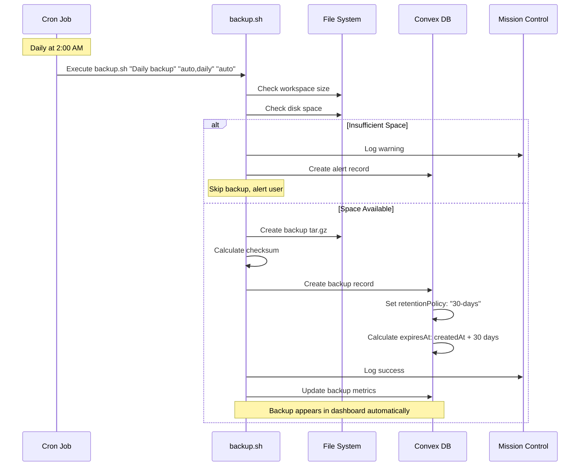
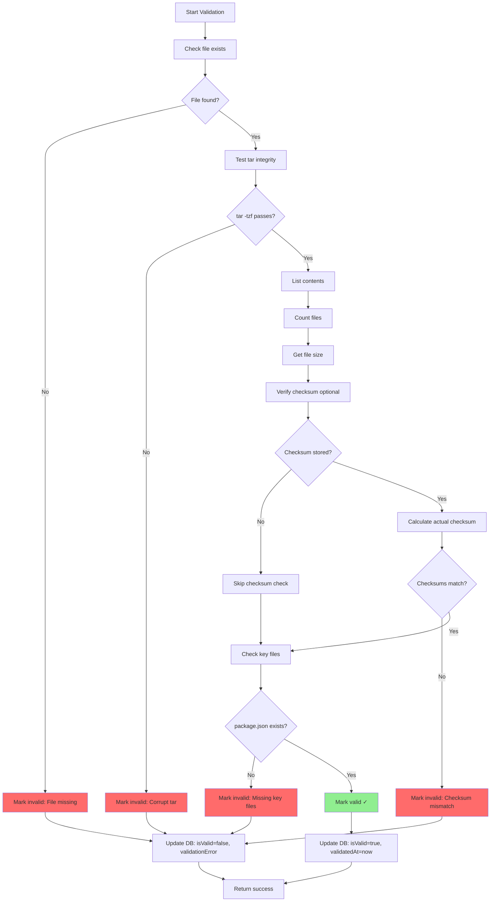
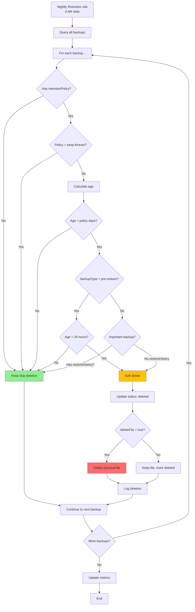
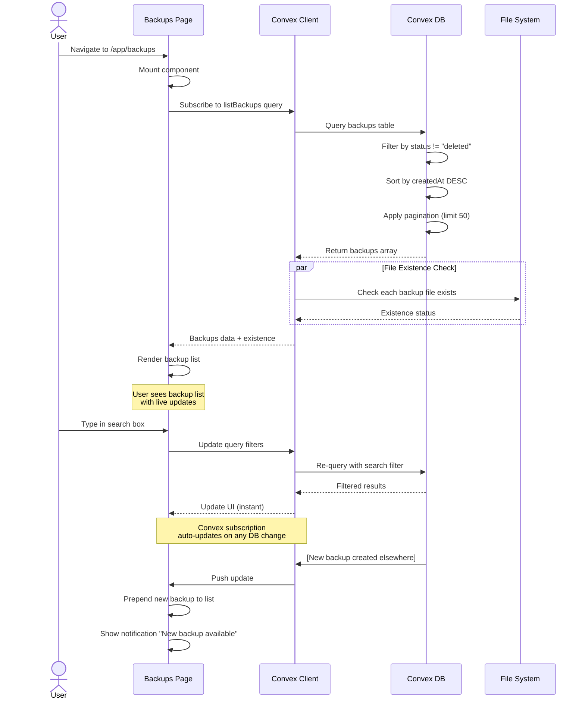
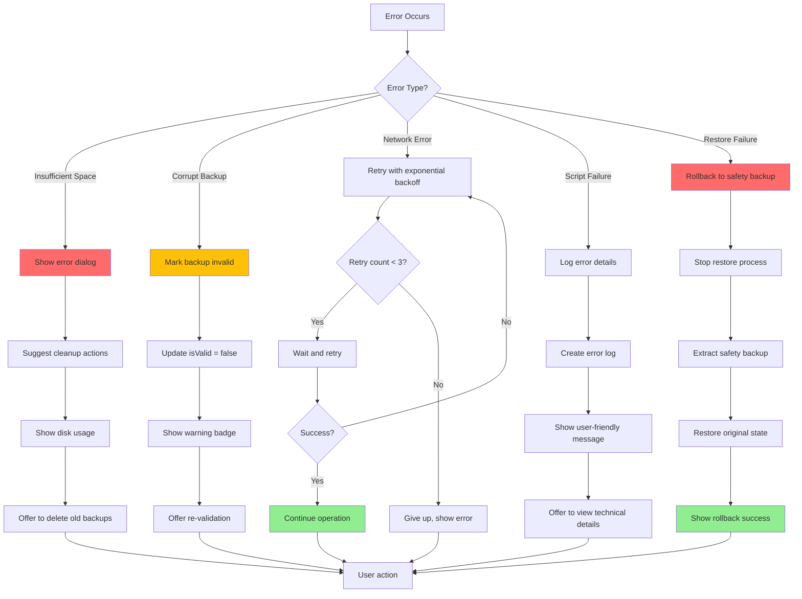
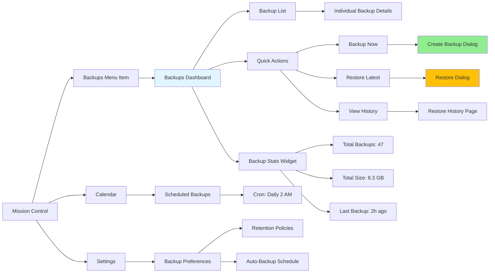

# Backup & Restore System: Workflow Diagrams

This document contains detailed workflow diagrams for all major operations in the Backup & Restore system.

---

## 1. Create Manual Backup Flow



**Key Points:**
- Validation happens both client-side and server-side
- Pre-backup checks prevent partial/failed backups
- Atomic operation: backup fully completes or fails entirely
- Metadata extracted during backup (no post-processing needed)

---

## 2. Restore from Backup Flow



**Key Safety Features:**
1. **Pre-validation:** Check backup integrity before touching workspace
2. **Safety backup:** Always create pre-restore backup (unless disabled)
3. **Atomic restore:** All files or none (rollback on failure)
4. **Service management:** Stop/start services to prevent file locks
5. **Post-validation:** Verify restore succeeded before declaring success

---

## 3. Search & Find Backup Flow



**Search Features:**
- **Full-text search:** Description, tags, filename
- **Date filters:** Exact date, date range, relative (last 7 days)
- **Tag filters:** Click tag to filter, multi-select
- **Smart suggestions:** Auto-complete based on history
- **Timeline grouping:** Today, Yesterday, This Week, This Month

---

## 4. Automatic Backup (Cron) Flow



**Cron Configuration:**
```bash
# In crontab
0 2 * * * /Users/openclaw/.openclaw/workspace/ops/backup.sh "Automatic daily backup" "auto,daily" "auto"

# In CRON_GOVERNANCE.md
Job: Daily Workspace Backup
Schedule: 0 2 * * * (2 AM daily)
Purpose: Automatic safety backups
Retention: 30 days
```

---

## 5. Backup Validation Flow



**When Validation Runs:**
1. **Before Restore:** Always validate before restoring
2. **On Demand:** User clicks "Validate" button
3. **Scheduled:** Weekly validation of all backups (cron job)
4. **On Upload:** If restoring from external backup

---

## 6. Backup Retention Policy Flow



**Retention Policies:**
- **keep-forever:** Never auto-delete (default for manual/milestone backups)
- **30-days:** Delete after 30 days (default for auto backups)
- **90-days:** Delete after 90 days (configurable)
- **pre-restore:** Delete after 24 hours (safety backups)

**Smart Retention:**
- Keep backups that have been restored (historical importance)
- Keep milestone backups regardless of age
- Warn before deleting large/old backups
- Soft-delete first (can be recovered for 7 days)

---

## 7. Backup List Loading & Rendering



**Performance Optimizations:**
- **Pagination:** Load 50 backups at a time
- **Virtual scrolling:** Render only visible rows (future)
- **Debounced search:** Wait 300ms after typing stops
- **Cached file checks:** Cache existence checks for 60s
- **Optimistic UI:** Show backup immediately, validate in background

---

## 8. Error Handling & Recovery Flow



**Error Categories:**

1. **User-Recoverable Errors:**
   - Insufficient disk space → Cleanup suggestions
   - Invalid backup selected → Show validation details
   - Missing backup file → Offer re-download or delete

2. **System-Recoverable Errors:**
   - Network timeouts → Auto-retry
   - Temporary file locks → Wait and retry
   - Service restart failure → Retry with sudo

3. **Critical Errors:**
   - Restore validation failure → Automatic rollback
   - Data corruption → Block operation, alert user
   - Permission denied → Show detailed instructions

---

## 9. Real-Time Progress Updates

```mermaid
sequenceDiagram
    participant UI as UI Component
    participant API as Next.js API
    participant Script as restore.sh
    participant DB as Convex DB
    
    UI->>API: POST /api/restore/start
    API->>Script: Execute restore.sh (background)
    API-->>UI: Return operationId
    
    UI->>UI: Open progress dialog
    UI->>DB: Subscribe to restoreOperation(operationId)
    
    loop Every 1-2 seconds
        Script->>DB: Update progress_percent
        Script->>DB: Update current_step
        DB->>UI: Push update via subscription
        UI->>UI: Update progress bar
        UI->>UI: Update status text
    end
    
    Script->>Script: Restore completes
    Script->>DB: Set status = "completed"
    Script->>DB: Set progress_percent = 100
    
    DB->>UI: Final update
    UI->>UI: Show success message
    UI->>UI: Close progress dialog
    UI->>UI: Refresh backup list
```



**Progress Steps:**
1. **0-10%:** Validating backup file
2. **10-20%:** Creating safety backup
3. **20-30%:** Stopping services
4. **30-50%:** Clearing workspace
5. **50-70%:** Extracting backup
6. **70-90%:** Restoring files
7. **90-95%:** Validating restore
8. **95-100%:** Restarting services

---

## 10. Integration with Mission Control



**Menu Structure:**
```
Mission Control
├── Tasks
├── Calendar
│   └── Scheduled Backups (shows auto-backup jobs)
├── Team
├── Memory
├── Office Space
├── Email Cleanup
└── Backups (NEW)
    ├── Dashboard (default view)
    ├── History (restore operations)
    └── Settings (retention, schedule)
```

---

## Summary

These workflows demonstrate:
- **Safety-first design:** Multiple validation points, automatic rollbacks
- **User-friendly:** Clear progress, helpful errors, smart defaults
- **Production-ready:** Error handling, retry logic, atomic operations
- **Real-time:** Live updates via Convex subscriptions
- **Integrated:** Seamlessly fits into Mission Control ecosystem

**Next Steps:**
1. Implement core backup/restore scripts
2. Build Convex schema and queries
3. Create UI components
4. Add real-time subscriptions
5. Comprehensive testing
6. Deploy and monitor
